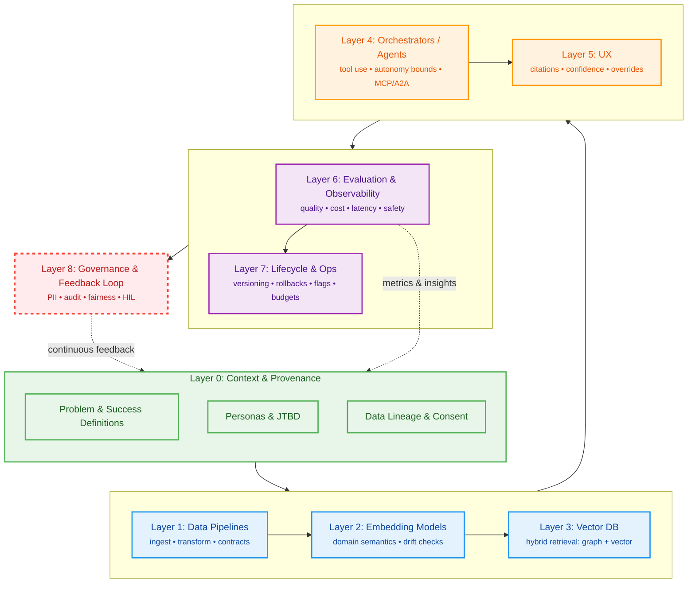
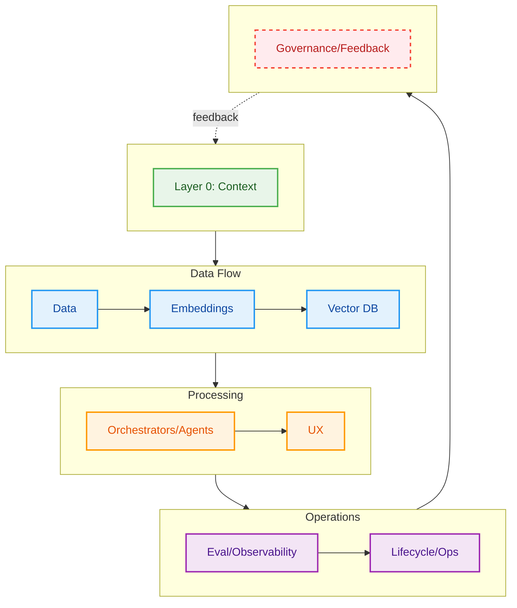

# Slide 1 — Title & Hook
- Product name, one-line value prop
- Hook: baseline pain and desired outcome

# Slide 2 — Problem
- Single-sentence problem
- Scope, non-goals, baseline metrics

# Slide 3 — Success
- North Star + guardrails
- Measurement plan

# Slide 4 — Audience
- Persona & JTBD
- Top tasks and acceptance criteria
- Stakeholder RACI (mini)

# Slide 5 — Solution Overview
- Before/after flow
- Where AI intervenes & why

**LLM Stack → 2025 Lifecycle (Layer 0–8):**

# Slide 6 — Demo
- Storyboard frames
- Trust, control, feedback loop
- Experiment plan

# Slide 7 — Infra Diagram
- Data → Decision → UX
- Governance overlays, monitoring, rollbacks

**Compact lifecycle view (for Infra focus):**

# Slide 8 — Results & Trade-offs
- Early signals / pilot data
- Key trade-offs & rationale

# Slide 9 — Conclusions
- Risks & mitigations
- Next steps
- GTM/enablement plan