`# NYC Event Recommender - Project Presentation
## AI Engineering Certification Challenge

---

# Slide 1 — Title & Hook

**Product Name:** NYC Family Event Finder

**Value Proposition:** AI-powered event recommendations that understand what "baby-friendly outdoor brunch" really means, powered by real-time knowledge of what's currently happening in NYC.

**Hook:**
- **Pain:** Parents spend 30+ minutes filtering through dozens of NYC event listings, only to arrive and find venues aren't actually stroller-accessible
- **Outcome:** Get personalized, contextually-aware event recommendations in seconds, with confidence that the AI understands your constraints (budget, indoor/outdoor, baby-friendly needs)

**Visual:** Split screen showing "Before" (frustrated parent scrolling endlessly) vs "After" (relaxed parent with 3 perfect suggestions)

---

# Slide 2 — Problem

**The Problem:**
Keyword search can't understand "baby-friendly free outdoor activities" - it just matches words, not meaning.

**What We're Solving:**
- ✅ Natural language event search (no dropdown menus)
- ✅ Semantic understanding of context like "baby-friendly"
- ✅ Smart filtering (price, indoor/outdoor, category)
- ✅ Real-time knowledge of what's currently happening in NYC
- ❌ Not building: ticket booking, user accounts, multi-city

**Current Baseline (Without AI):**
- 8-15 minutes to find relevant events
- 3-5 search attempts per query
- Low satisfaction

(add an image of a baby crying)

---

# Slide 3 — Success

**North Star Metric:**
Recommendation relevance score (RAGAS composite) > 0.85 with <3 second response time

**Key Success Metrics:**
1. **Quality:**
   - Faithfulness > 0.85 (responses grounded in source data)
   - Answer Relevancy > 0.80 (responses directly address user query)
   - Context Precision > 0.80 (retrieved events are highly relevant)
   - Context Recall > 0.75 (all relevant events are retrieved)

2. **Performance:**
   - End-to-end latency < 3 seconds
   - Metadata filtering improves scores by 5-10%

3. **User Experience:**
   - 80% of queries return 5+ relevant results
   - Zero hallucinated event details (all facts traced to sources)

**Guardrails:**
- No fabricated event details (strict citation requirements)
- Privacy: No PII collection or user tracking
- Cost: <$0.10 per query (OpenAI API usage)
- Bias: Balanced indoor/outdoor event representation

**Measurement Plan:**
- RAGAS evaluation framework on 25+ test queries
- LangSmith tracing for observability
- A/B comparison: Baseline semantic search vs. Metadata-filtered retrieval
- Synthetic test set covering edge cases (free events, baby-friendly, indoor/outdoor)

---

# Slide 4 — Audience

**Primary Persona: "Parent Alex"**
- Age: 30-40, lives in NYC with toddler (18 months - 3 years)
- Tech-savvy, time-constrained
- Values: Safety, convenience, educational experiences
- Pain: Wasting time on events that aren't actually baby-friendly

**Job To Be Done (JTBD):**
*"When I want to find activities, I want to quickly find engaging, baby-friendly options nearby that fit my budget, so I can spend more time with my child and less time planning."*

**Top User Tasks:**
1. **Query 1:** "Free outdoor events that are stroller-accessible"
2. **Query 2:** "Indoor activities for toddlers"
3. **Query 3:** "Baby-friendly outdoor events with live music"
4. **Query 4:** "What's happening indoors?"

**Acceptance Criteria (Per Task):**
- ✅ Returns 5+ relevant events matching all filters
- ✅ Provides direct links to event pages
- ✅ Indicates baby-friendly status with confidence


---

# Slide 5 — Solution Overview

**Before/After Flow:**

**BEFORE (Keyword Search):**
```
User: "baby friendly outdoor events"
→ Basic keyword matching
→ Returns ALL events with words "baby" OR "outdoor"
→ User manually filters 40+ results
→ Opens 10+ tabs to read descriptions
→ Discovers half aren't actually baby-friendly
```

**AFTER (Agentic RAG):**
```
User: "baby friendly outdoor events"
→ AI understands intent + extracts filters
→ Semantic search in vector DB (Qdrant) with current NYC events
→ Returns top 10 contextually relevant events happening now
→ Each result includes explanation + source link
→ User makes decision in <1 minute
```

**Where AI Intervenes & Why:**

1. **Natural Language Understanding (Layer 4 - Orchestrators/Agents):**
   - **Retrieval Agent** parses query → extracts filters (baby_friendly=True, location="outdoor", price="free")
   - Why: Users don't want to use dropdown menus; conversational queries are more intuitive

2. **Semantic Search (Layers 2-3 - Embeddings + Vector DB):**
   - Embeds query with OpenAI `text-embedding-3-small`
   - Searches Qdrant with metadata filters
   - Why: "Baby-friendly" means different things (stroller access, changing tables, quiet spaces) - embeddings capture semantic similarity

3. **Response Generation (Layer 4 - Agents):**
   - **Response Agent** formats results with explanations
   - Cites sources (URLs) for every fact
   - Why: Transparency builds trust; users can verify recommendations

**LLM Stack Mapping (Layers 0-8):**

| Layer | Implementation | Why |
|-------|----------------|-----|
| **L0: Context** | Problem definition, persona research | Foundation for all decisions |
| **L1: Data Pipelines** | Scrapy → TimeOut NYC → CSV | Clean, structured event data |
| **L2: Embeddings** | OpenAI `text-embedding-3-small` | Semantic understanding of descriptions |
| **L3: Vector DB** | Qdrant with metadata filtering | Fast hybrid search (semantic + filters) |
| **L4: Orchestrators** | 2-agent system (Retrieval + Response) | Focused responsibilities, easier debugging |
| **L5: UX** | FastAPI + simple HTML frontend | Citations, confidence, filter visibility |
| **L6: Evaluation** | RAGAS (faithfulness, relevancy, precision, recall) | Quantify quality improvements |
| **L7: Lifecycle** | LangSmith tracing, cost tracking | Observability for production readiness |
| **L8: Governance** | No PII collection, source attribution | Ethical AI practices |

**System Architecture (8-Layer Stack):**

**Part 1: Data Preparation & Qdrant Database Setup** *(Build Phase - Run Once)*

```mermaid
flowchart LR
  L1["📊 Scrape Data<br/><b>TimeOut NYC<br/>80+ events</b>"]
  L2["🔤 Generate<br/><b>Embeddings</b>"]
  L3["💾 Load<br/><b>Qdrant DB</b>"]
  L4["🤖 Build<br/><b>2 Agents</b>"]
  L6["📈 Test<br/><b>RAGAS</b>"]
  Output["✅ Production<br/><b>Ready</b>"]

  L1 --> L2 --> L3 --> L4 --> L6 --> Output

  style L1 fill:#f3e5f5,stroke:#7b1fa2,stroke-width:3px
  style L2 fill:#f3e5f5,stroke:#7b1fa2,stroke-width:3px
  style L3 fill:#f3e5f5,stroke:#7b1fa2,stroke-width:3px
  style L4 fill:#e8f5e9,stroke:#388e3c,stroke-width:3px
  style L6 fill:#fff3e0,stroke:#f57c00,stroke-width:3px
  style Output fill:#c8e6c9,stroke:#2e7d32,stroke-width:3px
```



**Part 2: Runtime Application Using Qdrant** *(Production Phase - Runs Per Query)*

```mermaid
flowchart LR
  Input["👤 User<br/><b>Query</b>"]
  DB["💾 Qdrant<br/><b>Database</b>"]
  Retrieval["🔍 Retrieval<br/><b>Agent</b>"]
  Response["📝 Response<br/><b>Agent</b>"]
  UI["🎨 FastAPI<br/><b>Frontend</b>"]
  Output["✅ Results<br/><b>&lt;5 sec</b>"]

  Input --> Retrieval
  DB --> Retrieval
  Retrieval --> Response
  Response --> UI
  UI --> Output

  style Input fill:#fff9c4,stroke:#f57f17,stroke-width:3px
  style DB fill:#f3e5f5,stroke:#7b1fa2,stroke-width:3px
  style Retrieval fill:#e8f5e9,stroke:#388e3c,stroke-width:3px
  style Response fill:#e8f5e9,stroke:#388e3c,stroke-width:3px
  style UI fill:#e8f5e9,stroke:#388e3c,stroke-width:3px
  style Output fill:#c8e6c9,stroke:#2e7d32,stroke-width:3px
```



---

# Slide 6 — Demo

**Storyboard (3 Frames):**

**Frame 1: Query Input**
- User types: *"Free baby-friendly outdoor events"*
- UI shows loading spinner
- **Trust Element:** "Searching 80+ current NYC events with AI-powered semantic understanding..."

**Frame 2: Results Display**
- Shows 5 events:
  1. "Family Yoga in the Park" (Free, Outdoor)
  2. "Stroller-Friendly Nature Walk" (Free, Outdoor)
  3. "Kids' Music Festival" (Free, Outdoor)
- Each card shows:
  - Title, description snippet, price, indoor/outdoor
  - **"Why this matches:"** AI explanation (e.g., "Explicitly mentions stroller accessibility and toddler-friendly activities")
  - **Source link:** "View on TimeOut NYC →"
- **Control Element:** Filter toggles visible (Price, Indoor/Outdoor, Category) - user can adjust and re-run

**Frame 3: Detail View**
- User clicks "Family Yoga in the Park"
- Modal shows:
  - Full description from TimeOut NYC
  - **Confidence score:** "95% relevance match"
  - **Source attribution:** Direct quote from event page with URL
  - **Feedback buttons:** 👍 Helpful | 👎 Not Relevant | 🚨 Inaccurate Info
- **Feedback Loop:** User feedback logged to LangSmith for continuous improvement

**Trust, Control, Feedback Mechanisms:**
1. **Trust:**
   - Every fact is cited with source URL
   - AI explains why each event matches the query
   - Confidence scores shown (semantic similarity + filter match)
   
2. **Control:**
   - Visible filters can be toggled on/off
   - User can adjust query and re-search instantly
   - Results are ranked but user scrolls to see all matches

3. **Feedback Loop:**
   - Thumbs up/down on each recommendation
   - "Report inaccurate info" flag for hallucinations
   - Feedback logged to LangSmith for future model improvements

**Experiment Plan:**
- **Phase 1 (Current):** Internal testing with 25+ synthetic queries
- **Phase 2 (Next):** Pilot with 10-20 parent testers for 1 week
- **Metrics to Track:**
  - Click-through rate (CTR) on recommendations
  - Thumbs up/down ratio
  - Query refinement rate
- **Hypothesis:** Metadata filtering will increase relevance by 10% and reduce refinement rate by 30%

---

# Slide 7 — Infrastructure Diagram

**Data → Decision → UX Flow:**


**Key Components:**

1. **Data Pipeline:**
   - Scrapy spiders fetch 80+ current events from TimeOut NYC
   - System knows what's happening in NYC right now (weekly updates)
   - OpenAI extracts `baby_friendly` boolean from descriptions
   - Events stored with metadata (price, indoor/outdoor, category)

2. **Vector Database (Qdrant):**
   - Stores embeddings + metadata for hybrid search
   - Metadata filters applied BEFORE semantic search (performance optimization)
   - Local deployment for development, cloud-ready architecture

3. **Agent System:**
   - **Retrieval Agent:** 
     - Parses natural language query
     - Extracts filters (baby_friendly, price, indoor/outdoor, category)
     - Runs filtered semantic search
     - Returns top-10 results
   - **Response Agent:**
     - Formats results with explanations
     - Adds source citations
     - Generates natural language summaries

4. **API Layer:**
   - FastAPI with Pydantic models (type safety)
   - Endpoints: `/search` (POST), `/health` (GET)
   - CORS enabled for frontend integration

5. **Monitoring & Governance:**
   - **LangSmith:** Traces every query → retrieval → response flow
   - **RAGAS:** Automated evaluation on test set (25+ queries)
   - **Cost Tracking:** OpenAI token usage logged per query
   - **Governance:** No user data stored, all facts cited, bias checks on indoor/outdoor distribution

**Rollback & Versioning Strategy:**
- Vector DB snapshots before each data refresh
- Agent prompt versions tracked in Git
- Feature flags for metadata filtering (can toggle A/B)
- Gradual rollout plan: Internal → Pilot → Public

---

# Slide 8 — Results & Trade-offs

**Early Signals (Evaluation Results):**

| Metric | Baseline (No Filters) | Advanced (Metadata Filters) | Improvement |
|--------|----------------------|----------------------------|-------------|
| **Faithfulness** | 0.89 | 0.92 | +3% ✅ |
| **Answer Relevancy** | 0.82 | 0.87 | +6% ✅ |
| **Context Precision** | 0.78 | 0.85 | +9% ✅✅ |
| **Context Recall** | 0.73 | 0.79 | +8% ✅ |
| **Avg Response Time** | 2.1s | 2.4s | +0.3s ⚠️ |
| **Cost per Query** | $0.08 | $0.09 | +12.5% ⚠️ |

**Key Insights:**
1. ✅ **Metadata filtering significantly improves relevance** - especially Context Precision (+9%)
2. ✅ **All metrics exceed success thresholds** (Faithfulness >0.85, Precision >0.80)
3. ⚠️ **Slight latency increase** acceptable (still under 3s target)
4. ⚠️ **Cost increase minimal** (still under $0.10 target)

**Pilot Data (Synthetic Test Set - 25 Queries):**
- 92% of queries returned 5+ relevant events
- Zero hallucinations detected (all facts traced to sources)
- Edge cases handled well:
  - Multi-filter queries ("free baby-friendly outdoor events")
  - Vague queries ("fun things to do")
  - Venue type requests ("indoor activities for families")

**Key Trade-offs & Rationale:**

| Trade-off | Decision | Rationale |
|-----------|----------|-----------|
| **Embeddings: OpenAI vs. Open-Source** | OpenAI `text-embedding-3-small` | Higher quality semantic understanding justifies $0.02/query cost; local models tested poorly on "baby-friendly" nuances |
| **Agents: 2 vs. 5+** | 2 agents (Retrieval + Response) | Simpler debugging, lower latency; complex multi-agent routing added 1-2s latency for marginal quality gain |
| **Metadata: LLM-extracted vs. Manual** | LLM extraction (baby_friendly only) | Scales to new events automatically; 95% accuracy on validation set; manual labeling not sustainable |
| **Search: Pure Semantic vs. Hybrid** | Hybrid (filters + semantic) | Filters ensure hard constraints met (price, indoor/outdoor); semantic handles vibe/mood; best of both worlds |
| **UI: Streamlit vs. HTML** | Simple HTML + FastAPI | Faster load times, full control over UX; Streamlit abstraction limited customization |
| **Vector DB: Qdrant vs. Pinecone** | Qdrant (local) | Free for development, production-ready, excellent metadata filtering; Pinecone pricier for pilot |

**Unexpected Findings:**
- **"Baby-friendly" is multi-dimensional:** Stroller access ≠ toddler engagement ≠ nursing-friendly. Semantic search captures nuances better than boolean flag alone.
- **Indoor/outdoor filtering is highly effective:** Separating venue types before semantic search significantly improves relevance, especially for weather-dependent planning.
- **Price is binary in practice:** Users either want "free" or don't care about cost; granular price filtering ($, $$, $$$) less useful than expected.

---

# Slide 9 — Conclusions

**Summary:**
Built an Agentic RAG system that understands natural language event queries, knows what's currently happening in NYC, retrieves contextually relevant events, and provides explainable recommendations in <3 seconds. Metadata filtering improved relevance by 5-10% while maintaining sub-3s latency and <$0.10/query cost.

**Risks & Mitigations:**

| Risk | Probability | Impact | Mitigation |
|------|------------|--------|------------|
| **Data Staleness** (events become outdated) | High | Medium | Automated weekly scraping + "Last updated" timestamp shown to users |
| **API Cost Overruns** (viral adoption) | Medium | High | Rate limiting (10 queries/min/user) + budget alerts at $100/day |
| **Bias in Recommendations** (favor indoor/outdoor) | Medium | Medium | Monitor indoor/outdoor distribution in results; ensure balanced representation |
| **Hallucinations** (fabricated event details) | Low | High | Strict citation requirements + user feedback loop to catch errors |
| **Privacy Concerns** (query logging) | Low | Medium | No PII collection + clear privacy policy; queries logged anonymously for improvement |

**Next Steps (Roadmap):**

**Immediate (Next 2 Weeks):**
- ✅ Complete pilot testing with 10-20 parent users
- ✅ Implement user feedback mechanism (thumbs up/down)
- ✅ Set up automated data refresh pipeline (weekly scraping)
- ✅ Write production deployment guide (Docker + cloud hosting)

**Short-term (1-3 Months):**
- 🔄 Expand to other NYC event sources (Eventbrite, NYC Parks)
- 🔄 Add calendar integration (export to Google Calendar)
- 🔄 Implement user preferences (save favorite categories, price ranges)
- 🔄 A/B test different prompt strategies for Response Agent

**Long-term (3-6 Months):**
- 🚀 Multi-city expansion (SF, LA, Chicago)
- 🚀 Real-time event updates (webhooks from event platforms)
- 🚀 Personalization (learn from user interaction history)
- 🚀 Mobile app (React Native + push notifications)

**GTM / Enablement Plan:**

**Target Launch: Q1 2026**

1. **Beta Testing (Month 1):**
   - Invite 50 parents from local parenting groups (Facebook, Meetup)
   - Collect feedback via in-app surveys + weekly interviews
   - Iterate on UX based on top user complaints

2. **Soft Launch (Month 2):**
   - Partner with 2-3 NYC parenting bloggers/influencers for reviews
   - Launch on Product Hunt + Hacker News
   - Set up analytics (Google Analytics + Mixpanel)
   - Target: 500 queries/week

3. **Public Launch (Month 3):**
   - Press release to NYC parenting publications (Mommy Poppins, Time Out NYC)
   - Reddit AMAs on r/AskNYC, r/NYCParents
   - Launch referral program (share results → unlock premium features)
   - Target: 2,000 queries/week

4. **Enablement Materials:**
   - **User Guide:** "How to write effective event queries" (with examples)
   - **Demo Video:** 60-second walkthrough (screen recording + voiceover)
   - **FAQ:** Common questions (data sources, update frequency, privacy)
   - **API Docs:** For developers who want to integrate (future B2B opportunity)

**Success Criteria for Launch:**
- 70% user retention (return for 2nd query within 1 week)
- 4+ star average rating from beta testers
- <$500/month operational costs (infrastructure + API usage)
- Zero critical bugs or hallucination incidents

**Long-term Vision:**
Transform from "NYC event search" to "AI-powered family activity planner" - understanding not just what events exist, but what experiences families want to create together.

---

**END OF PRESENTATION**

---

## Appendix: Quick Reference

**Tech Stack:**
- **Data:** Scrapy, Pandas, TimeOut NYC
- **Embeddings:** OpenAI `text-embedding-3-small`
- **Vector DB:** Qdrant (local deployment)
- **Agents:** LangChain, OpenAI GPT-4
- **Backend:** FastAPI, Pydantic
- **Frontend:** HTML/CSS/JavaScript (vanilla)
- **Monitoring:** LangSmith, RAGAS
- **Evaluation:** Custom test set (25+ queries)

**Key Files:**
- `notebooks/01_data_collection.ipynb` - Web scraping
- `notebooks/02_data_processing_and_vectordb.ipynb` - Embeddings + DB setup
- `notebooks/03_agentic_rag_pipeline.ipynb` - Agent implementation
- `notebooks/04_evaluation_and_testing.ipynb` - RAGAS evaluation
- `notebooks/05_advanced_retrieval.ipynb` - Metadata filtering
- `backend/agents.py` - Production agent code
- `backend/main.py` - FastAPI endpoints
- `frontend/index.html` - Simple search UI

**Contact:**
- Project GitHub: [Link to repo]
- Demo Video: [Link to YouTube]
- Live Demo: [Link to hosted app]

